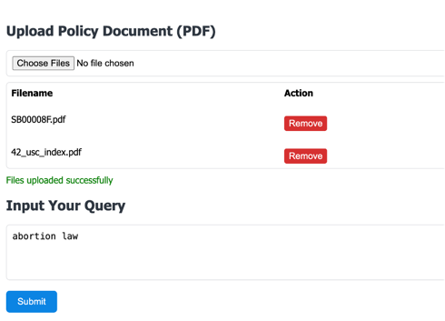

# IntelliGuard
A government-focused AI system that detects rumors and analyzes public sentiment on social media.

## Project Structure
```
IntelliGuard
|    -Dataset
|    -Model
|    -Policies
|    -SystemCode
|        -backend
|        -frontend
```      

# How to run it?
1. Clone the repository
    ```bash
    git clone https://github.com/yannsusu/IntelliGuard
    cd IntelliGuard

2. Set the environment
    ```bash
    pip install -r requirement.txt

3. Run the backend
    ```bash
   cd SystemCode/backend
   python app.py

4. Run the frontend
    ```bash
   cd ../frontend
   python start.py

## Example Usage
1. Upload policy document (`SB00008F`) on Polices Dictionary.
2. Input "`Abortion Law`" in the query box.

3. Rumor detection and sentiment analysis will be performed.

